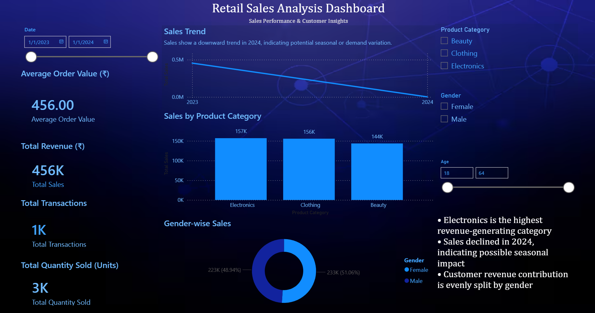

# 📊 Retail Sales Analysis Dashboard – Power BI

## 📌 Project Overview
This project presents an interactive Retail Sales Dashboard built using **Power BI** to analyze sales performance, product category trends, and customer segmentation.

The objective is to transform raw transactional retail data into actionable business insights that support data-driven decision-making.

## 📈 Key Metrics
- ₹456K+ Total Revenue  
- ₹456 Average Order Value  
- 1K+ Transactions  
- 3K+ Units Sold  

## 🔍 Business Insights
- Electronics is the highest revenue-generating category  
- Sales trend analysis (2023–2024) highlights potential seasonal fluctuations  
- Revenue contribution is evenly distributed across genders  
- Age-based customer segmentation analysis  

## 🛠 Tools & Technologies
- Power BI  
- DAX (Data Analysis Expressions)  
- Data Modeling & Relationship Management  
- Interactive Slicers & Filters  
- KPI Development  

## 🎯 Dashboard Features
- Dynamic date filtering (2023–2024)  
- Category-wise performance comparison  
- Gender and age segmentation  
- Executive-level KPI monitoring  

## 📷 Dashboard Preview

